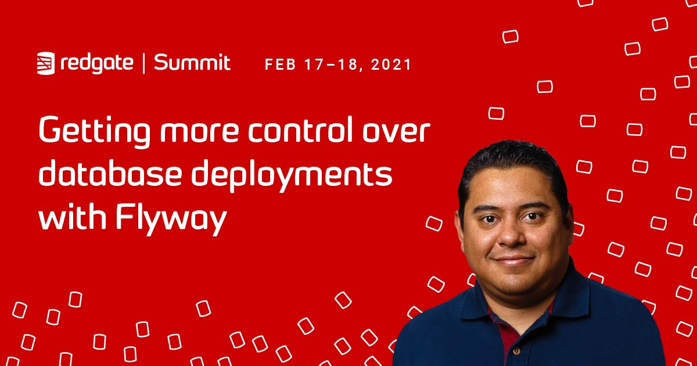

# Redgate Summit - The future of Database DevOps
## [Getting more control over database deployments with Flyway](https://bit.ly/3dd6Ori)  

Developers are always looking for ways to automate the continuous delivery of all database changes to guarantee everything happens efficiently and reliably, like they do for application deployments.

Flyway simplifies this process by introducing version control of database changes. With a rich collection of existing and brand-new features like cherry-pick, hot-fixes synchronization, and cloud storage locations, the latest version of this database migrations engine provides even more control over deployments. 

Join me in this session to explore and discuss the new features of Flyway v7 which make it one of best database version control and migration tools in the market.

## **Prerequisites**  
* Download [Flyway comand-line](https://flywaydb.org/download/)
* Experience with PostgreSQL databases, PGAdmin and software development
* Familiarity with containers

## **Demos**  
* [How to create demo environment](Demo_01)
* [Regular migrations](Demo_02)
* [Special migrations - New features](Demo_03)

## Questions?
If you have questions or comments about this demo, don't hesitate to contact me at <crobles@dbamastery.com>

## Follow me
   